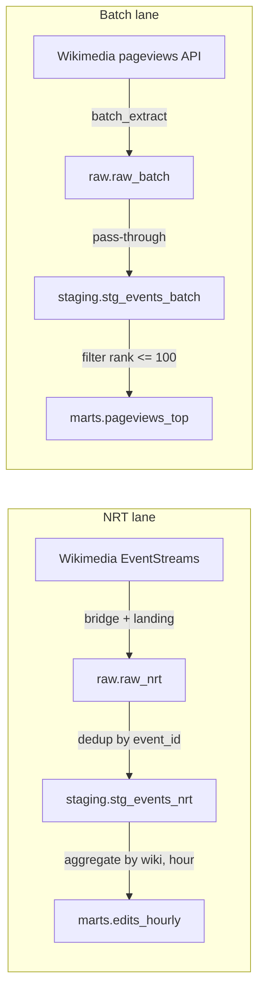

# Data model

This is the logical model glasspipe is built around — what a table
means, what one row is, how tables relate. Everything else (services,
orchestration, deploy) exists to fill these tables correctly and keep
them fresh. If this document and the SQL ever disagree, the SQL wins and
this needs fixing — but this is where you start reading, not the SQL.

## Approach: one big table, not a star schema

There are no dimension tables here (no `dim_wiki`, no `dim_user`). Every
table is **denormalized**: an event or a metric row carries all its own
attributes inline, rather than pointing at a shared dimension via a
surrogate key. This is a deliberate choice, not a shortcut:

- **ClickHouse is built for wide, flat tables.** Its columnar engine is
  optimized for scanning/aggregating columns of one big table; joining
  against small dimension tables on every query is where it's weakest.
  A star schema would fight the engine, not use it well.
- **KISS.** No surrogate keys to generate, no slowly-changing-dimension
  logic to write, no conformed-dimension bookkeeping across marts.

The cost, explicitly: if an entity like `wiki` ever needs its own rich,
time-varying attributes (language, region, category), there's nowhere to
put them today without duplicating them onto every row. That's the
concrete signal it would be time to introduce a real dimension table —
not before.

## Layers

Three layers, same meaning everywhere in this repo (this table exists
because the raw/staging distinction is genuinely easy to get backwards —
ask first, don't guess):

| Layer | Grain changes? | What it is | Mutable? |
|---|---|---|---|
| `raw` | no | Landed exactly as received, one row per source record | Append-only, never updated |
| `staging` | no | Same grain as raw, cleaned and deduplicated | Recomputed view, not stored state |
| `marts` | yes | Aggregated to a business grain, ready to query directly | Recomputed per run |

(Elsewhere you'll see `bronze`/`silver`/`gold` for the same three things
— different vendor, same idea. This repo uses `raw`/`staging`/`marts`
everywhere, full stop.)

## Lineage

Two lanes, deliberately never joined — see `ARCHITECTURE.md` principle
5. Nothing downstream of `raw.raw_nrt` ever reads `raw.raw_batch`, or
vice versa.

## Entity catalog

### `raw.raw_nrt`

One row per Wikimedia `recentchange` event. Append-only; loaded
incrementally and idempotently by `orchestration/orchestration/raw_loader.py`
(not a SQLMesh model — see `transform/README.md` for why). DDL:
`clickhouse/init/003_raw_nrt.sql`.

| Column | Type | Meaning |
|---|---|---|
| `event_id` | `String` | Wikimedia's `meta.id` — globally unique per event, the dedup key |
| `event_dt` | `DateTime64(3)` | Wikimedia's `meta.dt` — when the event occurred |
| `wiki` | `LowCardinality(String)` | Which wiki (e.g. `enwiki`) |
| `type` | `LowCardinality(String)` | `edit`, `new`, `log`, `categorize` |
| `namespace` | `Nullable(Int64)` | MediaWiki namespace of the page |
| `title` | `Nullable(String)` | Page title |
| `user` | `Nullable(String)` | Editor username (or IP for anonymous edits) |
| `bot` | `UInt8` | Whether the edit was flagged as a bot edit |
| `server_name` | `Nullable(String)` | Source domain, e.g. `en.wikipedia.org` |
| `length_old` / `length_new` | `Nullable(Int64)` | Page length in bytes, before/after |
| `revision_old` / `revision_new` | `Nullable(Int64)` | MediaWiki revision IDs, before/after |
| `raw_json` | `String` | The full original event, verbatim — the raw layer's actual source of truth; every typed column above is an extraction from this |

**Grain**: one row per `event_id` *as delivered* — at-least-once
delivery means the same `event_id` can legitimately appear more than
once. Resolving that is `staging`'s job, not this table's.

### `raw.raw_batch`

One row per (article, day) in the pageviews "top articles" result.
Written directly by `services/batch_extract` on its own schedule — not a
SQLMesh model. DDL: `clickhouse/init/002_raw_batch.sql`.

| Column | Type | Meaning |
|---|---|---|
| `date` | `Date` | The day these pageviews were counted |
| `project` | `LowCardinality(String)` | e.g. `en.wikipedia` |
| `access` | `LowCardinality(String)` | `all-access`, `desktop`, `mobile-app`, `mobile-web` |
| `article` | `String` | Article title |
| `views` | `UInt64` | View count for that day |
| `rank` | `UInt32` | Rank within that day's top list (1 = most viewed) |
| `fetched_at` | `DateTime` | When glasspipe pulled this row, not when it was counted |

**Grain**: one row per `(date, project, access, article)`.

### `raw._loaded_files`

Not part of the logical model — operational metadata. Tracks which
Parquet files have already been loaded into `raw.raw_nrt`, so the load
is idempotent and the cleanup job knows what's safe to delete. DDL:
`clickhouse/init/004_manifest.sql`.

### `staging.stg_events_nrt`

`transform/models/stg_events_nrt.sql`, kind `VIEW`. Same real-world
entity as `raw.raw_nrt` — a Wikimedia change event — but deduplicated:
`ROW_NUMBER() OVER (PARTITION BY event_id ORDER BY event_dt DESC)`,
keep `rn = 1`. Drops `length_old`/`revision_old` (nothing downstream
needs the "before" value, only the current state) and `raw_json` (its
job — full fidelity for reprocessing — is done once the typed columns
are trusted).

**Grain**: one row per `event_id`, guaranteed unique.

### `staging.stg_events_batch`

`transform/models/stg_events_batch.sql`, kind `VIEW`. Straight
pass-through of `raw.raw_batch` — exists so the batch lane has the same
two-layer shape as the NRT lane, even with no cleaning to do.

**Grain**: same as `raw.raw_batch` — `(date, project, access, article)`.

### `marts.edits_hourly`

`transform/models/edits_hourly.sql`, kind `INCREMENTAL_BY_TIME_RANGE`.
The NRT lane's answer to "how much editing activity is happening":

| Column | Meaning |
|---|---|
| `wiki` | Which wiki |
| `hour_ts` | Start of the hour (`toStartOfHour(event_dt)`) |
| `edit_count` | Total events that hour |
| `bot_edit_count` | Of those, flagged as bot edits |
| `distinct_editors` | `uniqExact(user)` for that hour |

**Grain**: one row per `(wiki, hour_ts)`. Audited (`not_null_wiki`) and
idempotent — re-running a given hour recomputes the same numbers from
`staging.stg_events_nrt`, it doesn't accumulate.

### `marts.pageviews_top`

`transform/models/pageviews_top.sql`, kind `VIEW`. The batch lane's
mart: `staging.stg_events_batch` filtered to `rank <= 100`, dropping
`fetched_at` (nothing at this layer needs to know when glasspipe pulled
the row, only what it says). Same grain as staging.

## Invariants

Things that are always true about this model, by construction — worth
knowing because code elsewhere depends on them silently:

- `raw.*` is never updated or deleted in place *by application code*.
  `raw.raw_nrt` can receive duplicate `event_id`s (at-least-once
  delivery); `raw.raw_batch` cannot (each `batch_extract` run inserts a
  disjoint `(date, project, access, article)` set). ClickHouse itself
  does age out old rows via a 5-day `TTL` on `event_dt`/`date`
  (`clickhouse/init/`) -- a fixed-size VPS can't hold this forever, and
  the raw layer isn't meant to be the pipeline's only durable copy (see
  "Retention" below). Nothing downstream of `raw.*` should assume a row
  older than 5 days is still there.
- `event_id` is the only dedup key in the whole model. Nothing downstream
  of `staging.stg_events_nrt` needs to think about duplicates again.
- No table joins `raw_nrt`/`stg_events_nrt` against `raw_batch`/`stg_events_batch`.
  If a future mart needs both, that's a new, explicitly-named model — the
  existing ones stay lane-pure.
- Every `marts.*` table is a pure function of `staging.*` (plus, for
  `edits_hourly`, the time range being backfilled). Re-running any mart
  for a given period always produces the same result.

## Retention

Found the hard way: nothing here had a retention policy until a small,
fixed-size VPS deployment made growth visible. `raw.raw_nrt` alone was
projecting to ~25 GiB/month at observed traffic -- more than a typical
small VPS's *entire* disk on its own, before counting anything else
glasspipe or ClickHouse itself writes.

| Table | TTL | Why this one |
|---|---|---|
| `raw.raw_nrt` | 5 days (`event_dt`) | The big one -- one row per event, including the full `raw_json`. The dominant cost. |
| `raw.raw_batch` | 5 days (`date`) | Negligible in bytes (~22 B/row) -- TTL'd anyway for consistency, at the cost of losing cheap long-term pageview-rank history. If that history turns out to matter more than the consistency, raise or drop this one independently of `raw_nrt`. |
| `raw._loaded_files` | 5 days (`loaded_at`) | Pure bookkeeping (see the manifest note in `raw._loaded_files` above) -- kept longer than `PARQUET_RETENTION_DAYS` (default 3) so a manifest row never expires before the Parquet file it tracks does; that ordering is what keeps the loader's idempotency check correct. |
| `staging.*` | none (views) | Views compute over `raw.*` on read -- nothing to expire independently; they age out exactly as their underlying `raw.*` rows do. |
| `marts.*` | **none, deliberately** | These are the pipeline's actual product: small (900 rows/day for `edits_hourly`), and the whole point is to keep aggregated history *after* the raw detail is gone. TTL-ing these would defeat the purpose glasspipe exists for. |
| Redpanda topic (`wikipedia.recentchange`) | `KAFKA_TOPIC_RETENTION_MS` / `KAFKA_TOPIC_RETENTION_BYTES`, default 6h / 2 GiB, whichever hits first | Not a ClickHouse table, but the same retention story: a short buffer between `bridge` (producer) and `landing` (near-real-time consumer), not a second copy of history. Applied by the `redpanda-init` step in `docker-compose.yml` on every startup, so it's enforced even if the topic gets recreated from scratch. Left at Redpanda's own defaults (7 days, unbounded bytes) it filled several GiB in under a day on a small VPS -- see "Lessons from the first live deploy" in `README.md`. |

Redpanda's topic retention is now deliberately *much shorter* than
`raw.raw_nrt`'s TTL -- it protects against `landing` downtime, it isn't a
second copy of query history. If `landing` is down (or falling behind)
longer than the topic's retention window, those rows age out of Redpanda
before `landing` ever reads them: a real gap in `raw.raw_nrt`, not just a
delay -- widen `KAFKA_TOPIC_RETENTION_MS`/`_BYTES` if that tradeoff needs
to move. `raw.raw_nrt`'s own 5-day TTL is what actually bounds how far
back this system can answer questions from raw NRT detail, independent of
Redpanda: once a row has landed, its lifetime is governed by the `TTL`
clause alone. Revisit either number if the actual disk budget or desired
audit window changes; the ClickHouse side is one `TTL` clause per table
(`clickhouse/init/002_raw_batch.sql`, `003_raw_nrt.sql`,
`004_manifest.sql`), plus `clickhouse/config/retention.xml` for
ClickHouse's own internal `system.*` log tables, which have no retention
by default and were already rivaling the pipeline's own data in testing
(~160 MiB in under 4 hours, `asynchronous_metric_log` alone past 11M
rows).
